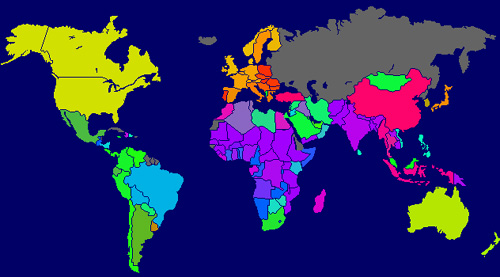
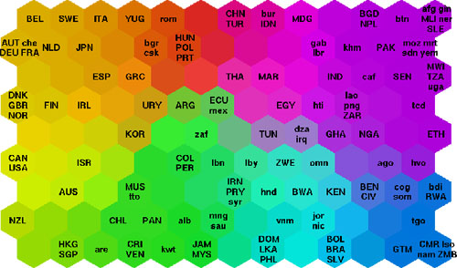

<!-- $theme: gaia -->
<!-- *template: invert -->

# Self-Organizing Maps (Özdüzenleyici Haritalar)
---
## SOM Nedir?
 - 1982 Yılında Tuevo Kohonen tarafından tanıtıldı.
 - Çok boyutlu verileri, yapay sinir ağlarını kullanarak az boyutlu verilere (genellikle 2) indirgeyen bir tekniktir.
 - Gözetimsiz Öğrenme (Unsupervised Learning) algoritmasıdır.
 - Rekabetçi öğrenme (Competitive Learning) temel alınır.
---

## SOM Yapısı
<!-- *template: invert -->

- Her bir nöron(node) inputlara bağlıdır.  
- Nöronlar arasında bir bağlantı yoktur
- Her nöronun kendine özel bir x ve y koordinatı vardır.
- Ayrıca her input için bir ağırlık vektörü içerirler.
---

# Algoritma

1- Tüm nöronlar için bir ağırlık atanır (rastgele).
2- Bir input vektörü seçilir.
3- Hangi nöronların ağırlıkları input vektörüne benzediğine bakılır. Kazanan nöron Best Matching Unit (BMU) olarak adlandırılır ve şu formül ile hesaplanır:
$Dist=\sqrt{\displaystyle\sum_{i=0}^{i=n}({V_i-W_i})^2}$ (Euclidean Distance)

$V$= input vektörü
$W$= Nöronun ağırlık vektörü

--- 

5- Daha sonra bütün nöronların ağırlıkları güncellenir:

#### $W(t+1)= W(t)+\theta(t)L(t)(V(t)-W(t))$

$\theta(t)$ = etkileme fonksiyonu
$L(t)$ = öğrenme oranı

6- $t$ arttırılır ve $t<\lambda$ olduğu sürece 2. adıma döneriz.

---
<!-- *template: invert -->
### Pythonda Gösterim

- Python kodunu burada bulabilirsiniz:

[Github](https://github.com/yektas/Self-Organizing-Maps/blob/master/som.py) (Pymvpa kütüphanesini yüklemeniz gerekiyor)

---

### Avantajları
- N-boyutlu bir veriyi 2 boyutlu bir veriye dönüştürebiliyoruz
- Basit bir algoritma olması ve açıklanması kolay
### Dezavantajları
- Her döngüde her nöronun ağırlıklarının değiştirilmesi
- Input verisinin açık ve rakamsal bir veri olması

---
<!-- *template: invert -->
## Uygulama Alanları

 
- Renk Sınıflandırma
- Müşteri segmentasyon profili
---

## Hazırlayan: [Ahmet Sercan Yektaş](https://github.com/yektas)
###### Marp ile hazırlandı [Buradan İnceleyebilirsiniz](https://github.com/yhatt/marp).
